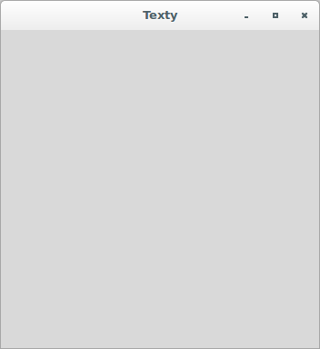
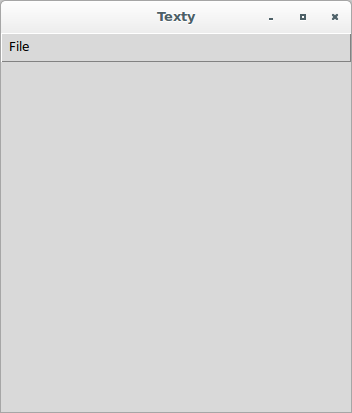
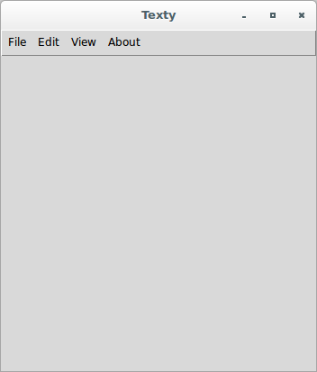
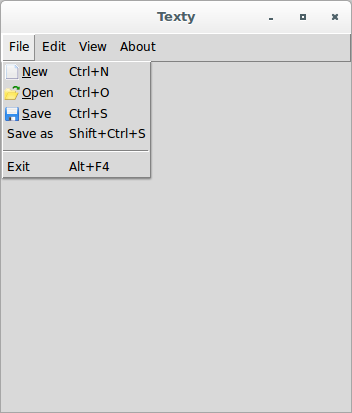
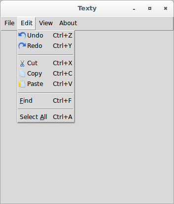
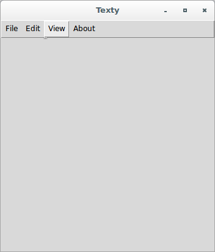
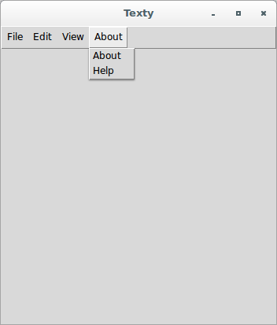

# Development

## Setting up the editor skeleton

Our first goal is to implement the broad visual elements of the text 
editor. As programmers, we have all used text editors to edit code. We 
are mostly aware of the common GUI elements of a text editor.

The first phase implements the widgets:

* Menu
* Menubutton
* Label
* Button
* Text
* Scrollbar

We will use the `pack()` geometry manager to place all the widgets. We 
have chosen the `pack` manager because it is ideally suited for the 
placing of widgets side by side or in a top-down position. Fortunately, 
in a text editor, we have all the widgets placed either side-by-side or 
in top-down locations. Thus, it is beneficial to use the `pack` manager. 
We can do the same thing with the `grid` manager as well.

Let's start by adding the **Toplevel** window by using the following 
code:

```python
#!/usr/bin/env python3
from tkinter import *
root = Tk()
# all our code goes here
root.mainloop()
```

Also, add a constant and a couple of methods for that window:

```python
...
PROGRAM_NAME = "Texty"    # application's name
...
root.geometry('350x350')    # root size
root.title(PROGRAM_NAME)    # root title
...
```

The application's source code is:

```python
#!/usr/bin/env python3
from tkinter import *

PROGRAM_NAME = "Texty"

root = Tk()
root.geometry('350x350')
root.title(PROGRAM_NAME)

root.mainloop()
```



Also, type `$ git checkout 1b` to perform a checkout of this version.

## Adding a menu and menu items (File menu)

Menus offer a very compact way of presenting a large number of choices 
to the user without cluttering the interface. Tkinter offers the 
following two widgets to handle menus:

* **The Menu widget:** This appears at the top of applications, which is 
always visible to end users.
* **The menu Items:** This shows up when a user clicks on a menu.

We will use the following code to add Toplevel menu buttons:

```python
menu_bar = Menu(parent, **options)
```

For example, to add a **File** menu, we will use the following code:

```python
...
menu_bar = Menu(root)    # add a menubar to the 'root' window
file_menu = Menu(menu_bar, tearoff=0)
menu_bar.add_cascade(label='File', menu=file_menu)
root.config(menu=menu_bar)
...
```

The application's source code is:

```python
#!/usr/bin/env python3
from tkinter import *

PROGRAM_NAME = "Texty"

root = Tk()
root.geometry('350x350')
root.title(PROGRAM_NAME)

menu_bar = Menu(root)
file_menu = Menu(menu_bar, tearoff=0)
menu_bar.add_cascade(label='File', menu=file_menu)
root.config(menu=menu_bar)

root.mainloop()
```



Also, type `$ git checkout 2a` to perform a checkout of this version.

## Adding a menu and menu items (Edit, View and About menus)

To complement the previous step, add **Edit**, **View**, and **About** 
menus:

```python
...
edit_menu = Menu(menu_bar, tearoff=0)
view_menu = Menu(menu_bar, tearoff=0)
about_menu = Menu(menu_bar, tearoff=0)
...
menu_bar.add_cascade(label='Edit', menu=edit_menu)
menu_bar.add_cascade(label='View', menu=view_menu)
menu_bar.add_cascade(label='About', menu=about_menu)
...
```

The application's source code is:

```python
#!/usr/bin/env python3
from tkinter import *

PROGRAM_NAME = "Texty"

root = Tk()
root.geometry('350x350')
root.title(PROGRAM_NAME)

menu_bar = Menu(root)
file_menu = Menu(menu_bar, tearoff=0)
edit_menu = Menu(menu_bar, tearoff=0)
view_menu = Menu(menu_bar, tearoff=0)
about_menu = Menu(menu_bar, tearoff=0)
menu_bar.add_cascade(label='File', menu=file_menu)
menu_bar.add_cascade(label='Edit', menu=edit_menu)
menu_bar.add_cascade(label='View', menu=view_menu)
menu_bar.add_cascade(label='About', menu=about_menu)
root.config(menu=menu_bar)

root.mainloop()
```



Also, type `$ git checkout 2b` to perform a checkout of this version.

## Adding a menu and menu items (menu items with icons)

Before the next step is completed, make sure the following icons are 
available within the "files" folder:

* new_file.gif
* open_file.gif
* save.gif
* cut.gif
* copy.gif
* paste.gif
* undo.gif
* redo.gif

Then, prepare such icons for menu items:

```python
...
new_file_icon = PhotoImage(file='files/new_file.gif')
open_file_icon = PhotoImage(file='files/open_file.gif')
save_file_icon = PhotoImage(file='files/save.gif')
cut_icon = PhotoImage(file='files/cut.gif')
copy_icon = PhotoImage(file='files/copy.gif')
paste_icon = PhotoImage(file='files/paste.gif')
undo_icon = PhotoImage(file='files/undo.gif')
redo_icon = PhotoImage(file='files/redo.gif')
...
```

Next, we will add menu items for the **File** menu:

```python
...
file_menu.add_command(label = 'New', 
                      accelerator = 'Ctrl+N', 
                      compound = 'left', 
                      image = new_file_icon, 
                      underline = 0)
file_menu.add_command(label = 'Open', 
                      accelerator = 'Ctrl+O', 
                      compound = 'left', 
                      image = open_file_icon, 
                      underline = 0)
file_menu.add_command(label = 'Save', 
                      accelerator = 'Ctrl+S', 
                      compound = 'left', 
                      image = save_file_icon, 
                      underline = 0)
file_menu.add_command(label = 'Save as', 
                      accelerator = 'Shift+Ctrl+S')
file_menu.add_separator()
file_menu.add_command(label = 'Exit', 
                      accelerator = 'Alt+F4')
...
```

Add menu items for the **Edit** menu:

```python
...
edit_menu.add_command(label = 'Undo', 
                      accelerator = 'Ctrl+Z', 
                      compound = 'left', 
                      image = undo_icon)
edit_menu.add_command(label = 'Redo', 
                      accelerator = 'Ctrl+Y', 
                      compound = 'left', 
                      image = redo_icon)
edit_menu.add_separator()
edit_menu.add_command(label = 'Cut', 
                      accelerator = 'Ctrl+X', 
                      compound = 'left', 
                      image = cut_icon)
edit_menu.add_command(label = 'Copy', 
                      accelerator = 'Ctrl+C', 
                      compound = 'left', 
                      image = copy_icon)
edit_menu.add_command(label = 'Paste', 
                      accelerator = 'Ctrl+V', 
                      compound = 'left', 
                      image = paste_icon)
edit_menu.add_separator()
edit_menu.add_command(label = 'Find', 
                      underline = 0, 
                      accelerator = 'Ctrl+F')
edit_menu.add_separator()
edit_menu.add_command(label = 'Select All', 
                      underline = 7, 
                      accelerator = 'Ctrl+A')
...
```

Add menu items for the **About** menu:

```python
...
about_menu.add_command(label='About')
about_menu.add_command(label='Help')
...
```

The application's source code is:

```python
#!/usr/bin/env python3
from tkinter import *

PROGRAM_NAME = "Texty"

root = Tk()
root.geometry('350x350')
root.title(PROGRAM_NAME)

new_file_icon = PhotoImage(file='files/new_file.gif')
open_file_icon = PhotoImage(file='files/open_file.gif')
save_file_icon = PhotoImage(file='files/save.gif')
cut_icon = PhotoImage(file='files/cut.gif')
copy_icon = PhotoImage(file='files/copy.gif')
paste_icon = PhotoImage(file='files/paste.gif')
undo_icon = PhotoImage(file='files/undo.gif')
redo_icon = PhotoImage(file='files/redo.gif')

menu_bar = Menu(root)
file_menu = Menu(menu_bar, tearoff=0)
edit_menu = Menu(menu_bar, tearoff=0)
view_menu = Menu(menu_bar, tearoff=0)
about_menu = Menu(menu_bar, tearoff=0)

menu_bar.add_cascade(label='File', menu=file_menu)
file_menu.add_command(label = 'New', 
                      accelerator = 'Ctrl+N', 
                      compound = 'left', 
                      image = new_file_icon, 
                      underline = 0)
file_menu.add_command(label = 'Open', 
                      accelerator = 'Ctrl+O', 
                      compound = 'left', 
                      image = open_file_icon, 
                      underline = 0)
file_menu.add_command(label = 'Save', 
                      accelerator = 'Ctrl+S', 
                      compound = 'left', 
                      image = save_file_icon, 
                      underline = 0)
file_menu.add_command(label = 'Save as', 
                      accelerator = 'Shift+Ctrl+S')
file_menu.add_separator()
file_menu.add_command(label = 'Exit', 
                      accelerator = 'Alt+F4')

menu_bar.add_cascade(label='Edit', menu=edit_menu)
edit_menu.add_command(label = 'Undo', 
                      accelerator = 'Ctrl+Z', 
                      compound = 'left', 
                      image = undo_icon)
edit_menu.add_command(label = 'Redo', 
                      accelerator = 'Ctrl+Y', 
                      compound = 'left', 
                      image = redo_icon)
edit_menu.add_separator()
edit_menu.add_command(label = 'Cut', 
                      accelerator = 'Ctrl+X', 
                      compound = 'left', 
                      image = cut_icon)
edit_menu.add_command(label = 'Copy', 
                      accelerator = 'Ctrl+C', 
                      compound = 'left', 
                      image = copy_icon)
edit_menu.add_command(label = 'Paste', 
                      accelerator = 'Ctrl+V', 
                      compound = 'left', 
                      image = paste_icon)
edit_menu.add_separator()
edit_menu.add_command(label = 'Find', 
                      underline = 0, 
                      accelerator = 'Ctrl+F')
edit_menu.add_separator()
edit_menu.add_command(label = 'Select All', 
                      underline = 7, 
                      accelerator = 'Ctrl+A')

menu_bar.add_cascade(label='View', menu=view_menu)

menu_bar.add_cascade(label='About', menu=about_menu)
about_menu.add_command(label='About')
about_menu.add_command(label='Help')

root.config(menu=menu_bar)

root.mainloop()
```









Also, type `$ git checkout 2c` to perform a checkout of this version.
