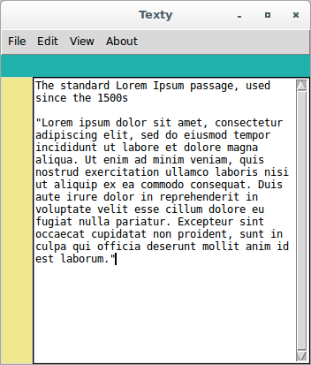
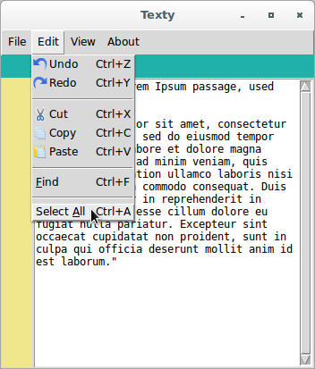
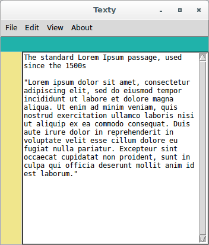
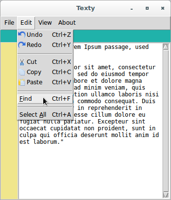
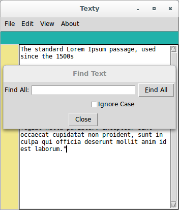
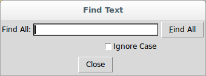
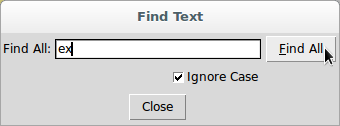
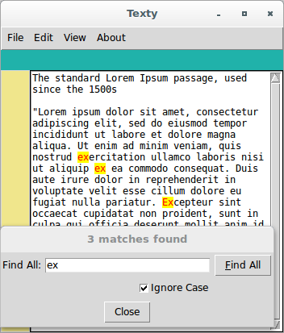

# Development

## Setting up the editor skeleton

Our first goal is to implement the broad visual elements of the text 
editor. As programmers, we have all used text editors to edit code. We 
are mostly aware of the common GUI elements of a text editor.

The first phase implements the widgets:

* Menu
* Menubutton
* Label
* Button
* Text
* Scrollbar

We will use the `pack()` geometry manager to place all the widgets. We 
have chosen the `pack` manager because it is ideally suited for the 
placing of widgets side by side or in a top-down position. Fortunately, 
in a text editor, we have all the widgets placed either side-by-side or 
in top-down locations. Thus, it is beneficial to use the `pack` manager. 
We can do the same thing with the `grid` manager as well.

Let's start by adding the **Toplevel** window by using the following 
code:

```python
#!/usr/bin/env python3
from tkinter import *
root = Tk()
# all our code goes here
root.mainloop()
```

Also, add a constant and a couple of methods for that window:

```python
...
PROGRAM_NAME = "Texty"    # application's name
...
root.geometry('350x350')    # root size
root.title(PROGRAM_NAME)    # root title
...
```

The application's source code is:

```python
#!/usr/bin/env python3
from tkinter import *

PROGRAM_NAME = "Texty"

root = Tk()
root.geometry('350x350')
root.title(PROGRAM_NAME)

root.mainloop()
```


Also, type `$ git checkout 1b` to perform a checkout of this version.

## Adding a menu and menu items (File menu)

Menus offer a very compact way of presenting a large number of choices 
to the user without cluttering the interface. Tkinter offers the 
following two widgets to handle menus:

* **The Menu widget:** This appears at the top of applications, which is 
always visible to end users.
* **The menu Items:** This shows up when a user clicks on a menu.

We will use the following code to add Toplevel menu buttons:

```python
menu_bar = Menu(parent, **options)
```

For example, to add a **File** menu, we will use the following code:

```python
...
menu_bar = Menu(root)    # add a menubar to the 'root' window
file_menu = Menu(menu_bar, tearoff=0)
menu_bar.add_cascade(label='File', menu=file_menu)
root.config(menu=menu_bar)
...
```

The application's source code is:

```python
#!/usr/bin/env python3
from tkinter import *

PROGRAM_NAME = "Texty"

root = Tk()
root.geometry('350x350')
root.title(PROGRAM_NAME)

menu_bar = Menu(root)
file_menu = Menu(menu_bar, tearoff=0)
menu_bar.add_cascade(label='File', menu=file_menu)
root.config(menu=menu_bar)

root.mainloop()
```


Also, type `$ git checkout 2a` to perform a checkout of this version.

## Adding a menu and menu items (Edit, View and About menus)

To complement the previous step, add **Edit**, **View**, and **About** 
menus:

```python
...
edit_menu = Menu(menu_bar, tearoff=0)
view_menu = Menu(menu_bar, tearoff=0)
about_menu = Menu(menu_bar, tearoff=0)
...
menu_bar.add_cascade(label='Edit', menu=edit_menu)
menu_bar.add_cascade(label='View', menu=view_menu)
menu_bar.add_cascade(label='About', menu=about_menu)
...
```

The application's source code is:

```python
#!/usr/bin/env python3
from tkinter import *

PROGRAM_NAME = "Texty"

root = Tk()
root.geometry('350x350')
root.title(PROGRAM_NAME)

menu_bar = Menu(root)
file_menu = Menu(menu_bar, tearoff=0)
edit_menu = Menu(menu_bar, tearoff=0)
view_menu = Menu(menu_bar, tearoff=0)
about_menu = Menu(menu_bar, tearoff=0)
menu_bar.add_cascade(label='File', menu=file_menu)
menu_bar.add_cascade(label='Edit', menu=edit_menu)
menu_bar.add_cascade(label='View', menu=view_menu)
menu_bar.add_cascade(label='About', menu=about_menu)
root.config(menu=menu_bar)

root.mainloop()
```


Also, type `$ git checkout 2b` to perform a checkout of this version.

## Adding a menu and menu items (menu items with icons)

Before the next step is completed, make sure the following icons are 
available within the "files" folder:

* new_file.gif
* open_file.gif
* save.gif
* cut.gif
* copy.gif
* paste.gif
* undo.gif
* redo.gif

Then, prepare such icons for menu items:

```python
...
new_file_icon = PhotoImage(file='files/new_file.gif')
open_file_icon = PhotoImage(file='files/open_file.gif')
save_file_icon = PhotoImage(file='files/save.gif')
cut_icon = PhotoImage(file='files/cut.gif')
copy_icon = PhotoImage(file='files/copy.gif')
paste_icon = PhotoImage(file='files/paste.gif')
undo_icon = PhotoImage(file='files/undo.gif')
redo_icon = PhotoImage(file='files/redo.gif')
...
```

Next, we will add menu items for the **File** menu:

```python
...
file_menu.add_command(label = 'New', 
                      accelerator = 'Ctrl+N', 
                      compound = 'left', 
                      image = new_file_icon, 
                      underline = 0)
file_menu.add_command(label = 'Open', 
                      accelerator = 'Ctrl+O', 
                      compound = 'left', 
                      image = open_file_icon, 
                      underline = 0)
file_menu.add_command(label = 'Save', 
                      accelerator = 'Ctrl+S', 
                      compound = 'left', 
                      image = save_file_icon, 
                      underline = 0)
file_menu.add_command(label = 'Save as', 
                      accelerator = 'Shift+Ctrl+S')
file_menu.add_separator()
file_menu.add_command(label = 'Exit', 
                      accelerator = 'Alt+F4')
...
```

Add menu items for the **Edit** menu:

```python
...
edit_menu.add_command(label = 'Undo', 
                      accelerator = 'Ctrl+Z', 
                      compound = 'left', 
                      image = undo_icon)
edit_menu.add_command(label = 'Redo', 
                      accelerator = 'Ctrl+Y', 
                      compound = 'left', 
                      image = redo_icon)
edit_menu.add_separator()
edit_menu.add_command(label = 'Cut', 
                      accelerator = 'Ctrl+X', 
                      compound = 'left', 
                      image = cut_icon)
edit_menu.add_command(label = 'Copy', 
                      accelerator = 'Ctrl+C', 
                      compound = 'left', 
                      image = copy_icon)
edit_menu.add_command(label = 'Paste', 
                      accelerator = 'Ctrl+V', 
                      compound = 'left', 
                      image = paste_icon)
edit_menu.add_separator()
edit_menu.add_command(label = 'Find', 
                      underline = 0, 
                      accelerator = 'Ctrl+F')
edit_menu.add_separator()
edit_menu.add_command(label = 'Select All', 
                      underline = 7, 
                      accelerator = 'Ctrl+A')
...
```

Add menu items for the **About** menu:

```python
...
about_menu.add_command(label='About')
about_menu.add_command(label='Help')
...
```

The application's source code is:

```python
#!/usr/bin/env python3
from tkinter import *

PROGRAM_NAME = "Texty"

root = Tk()
root.geometry('350x350')
root.title(PROGRAM_NAME)

new_file_icon = PhotoImage(file='files/new_file.gif')
open_file_icon = PhotoImage(file='files/open_file.gif')
save_file_icon = PhotoImage(file='files/save.gif')
cut_icon = PhotoImage(file='files/cut.gif')
copy_icon = PhotoImage(file='files/copy.gif')
paste_icon = PhotoImage(file='files/paste.gif')
undo_icon = PhotoImage(file='files/undo.gif')
redo_icon = PhotoImage(file='files/redo.gif')

menu_bar = Menu(root)
file_menu = Menu(menu_bar, tearoff=0)
edit_menu = Menu(menu_bar, tearoff=0)
view_menu = Menu(menu_bar, tearoff=0)
about_menu = Menu(menu_bar, tearoff=0)

menu_bar.add_cascade(label='File', menu=file_menu)
file_menu.add_command(label = 'New', 
                      accelerator = 'Ctrl+N', 
                      compound = 'left', 
                      image = new_file_icon, 
                      underline = 0)
file_menu.add_command(label = 'Open', 
                      accelerator = 'Ctrl+O', 
                      compound = 'left', 
                      image = open_file_icon, 
                      underline = 0)
file_menu.add_command(label = 'Save', 
                      accelerator = 'Ctrl+S', 
                      compound = 'left', 
                      image = save_file_icon, 
                      underline = 0)
file_menu.add_command(label = 'Save as', 
                      accelerator = 'Shift+Ctrl+S')
file_menu.add_separator()
file_menu.add_command(label = 'Exit', 
                      accelerator = 'Alt+F4')

menu_bar.add_cascade(label='Edit', menu=edit_menu)
edit_menu.add_command(label = 'Undo', 
                      accelerator = 'Ctrl+Z', 
                      compound = 'left', 
                      image = undo_icon)
edit_menu.add_command(label = 'Redo', 
                      accelerator = 'Ctrl+Y', 
                      compound = 'left', 
                      image = redo_icon)
edit_menu.add_separator()
edit_menu.add_command(label = 'Cut', 
                      accelerator = 'Ctrl+X', 
                      compound = 'left', 
                      image = cut_icon)
edit_menu.add_command(label = 'Copy', 
                      accelerator = 'Ctrl+C', 
                      compound = 'left', 
                      image = copy_icon)
edit_menu.add_command(label = 'Paste', 
                      accelerator = 'Ctrl+V', 
                      compound = 'left', 
                      image = paste_icon)
edit_menu.add_separator()
edit_menu.add_command(label = 'Find', 
                      underline = 0, 
                      accelerator = 'Ctrl+F')
edit_menu.add_separator()
edit_menu.add_command(label = 'Select All', 
                      underline = 7, 
                      accelerator = 'Ctrl+A')

menu_bar.add_cascade(label='View', menu=view_menu)

menu_bar.add_cascade(label='About', menu=about_menu)
about_menu.add_command(label='About')
about_menu.add_command(label='Help')

root.config(menu=menu_bar)

root.mainloop()
```


Also, type `$ git checkout 2c` to perform a checkout of this version.

## Adding widgets to hold shortcut icons and display line numbers

Next, we will add a Frame widget to hold the shortcut icons. We will 
also add a Text widget to the left to display line numbers.

Let's create the Frame widget:

```python
...
shortcut_bar = Frame(root,  height=25, background='light sea green')
shortcut_bar.pack(expand='no', fill='x')
...
```

Now, create the Text widget:

```python
...
line_number_bar = Text(root, 
                       width = 4, 
                       padx = 3, 
                       takefocus = 0, 
                       border = 0, 
                       background = 'khaki', 
                       state = 'disabled', 
                       wrap = 'none')
line_number_bar.pack(side='left', fill='y')
...
```

The application's source code is:

```python
#!/usr/bin/env python3
from tkinter import *

PROGRAM_NAME = "Texty"

root = Tk()
root.geometry('350x350')
root.title(PROGRAM_NAME)

new_file_icon = PhotoImage(file='files/new_file.gif')
open_file_icon = PhotoImage(file='files/open_file.gif')
save_file_icon = PhotoImage(file='files/save.gif')
cut_icon = PhotoImage(file='files/cut.gif')
copy_icon = PhotoImage(file='files/copy.gif')
paste_icon = PhotoImage(file='files/paste.gif')
undo_icon = PhotoImage(file='files/undo.gif')
redo_icon = PhotoImage(file='files/redo.gif')

menu_bar = Menu(root)
file_menu = Menu(menu_bar, tearoff=0)
edit_menu = Menu(menu_bar, tearoff=0)
view_menu = Menu(menu_bar, tearoff=0)
about_menu = Menu(menu_bar, tearoff=0)

menu_bar.add_cascade(label='File', menu=file_menu)
file_menu.add_command(label = 'New', 
                      accelerator = 'Ctrl+N', 
                      compound = 'left', 
                      image = new_file_icon, 
                      underline = 0)
file_menu.add_command(label = 'Open', 
                      accelerator = 'Ctrl+O', 
                      compound = 'left', 
                      image = open_file_icon, 
                      underline = 0)
file_menu.add_command(label = 'Save', 
                      accelerator = 'Ctrl+S', 
                      compound = 'left', 
                      image = save_file_icon, 
                      underline = 0)
file_menu.add_command(label = 'Save as', 
                      accelerator = 'Shift+Ctrl+S')
file_menu.add_separator()
file_menu.add_command(label = 'Exit', 
                      accelerator = 'Alt+F4')

menu_bar.add_cascade(label='Edit', menu=edit_menu)
edit_menu.add_command(label = 'Undo', 
                      accelerator = 'Ctrl+Z', 
                      compound = 'left', 
                      image = undo_icon)
edit_menu.add_command(label = 'Redo', 
                      accelerator = 'Ctrl+Y', 
                      compound = 'left', 
                      image = redo_icon)
edit_menu.add_separator()
edit_menu.add_command(label = 'Cut', 
                      accelerator = 'Ctrl+X', 
                      compound = 'left', 
                      image = cut_icon)
edit_menu.add_command(label = 'Copy', 
                      accelerator = 'Ctrl+C', 
                      compound = 'left', 
                      image = copy_icon)
edit_menu.add_command(label = 'Paste', 
                      accelerator = 'Ctrl+V', 
                      compound = 'left', 
                      image = paste_icon)
edit_menu.add_separator()
edit_menu.add_command(label = 'Find', 
                      underline = 0, 
                      accelerator = 'Ctrl+F')
edit_menu.add_separator()
edit_menu.add_command(label = 'Select All', 
                      underline = 7, 
                      accelerator = 'Ctrl+A')

menu_bar.add_cascade(label='View', menu=view_menu)

menu_bar.add_cascade(label='About', menu=about_menu)
about_menu.add_command(label='About')
about_menu.add_command(label='Help')

root.config(menu=menu_bar)

shortcut_bar = Frame(root,  height=25, background='light sea green')
shortcut_bar.pack(expand='no', fill='x')

line_number_bar = Text(root, 
                       width = 4, 
                       padx = 3, 
                       takefocus = 0, 
                       border = 0, 
                       background = 'khaki', 
                       state = 'disabled', 
                       wrap = 'none')
line_number_bar.pack(side='left', fill='y')

root.mainloop()
```


Also, type `$ git checkout 3a` to perform a checkout of this version.

## Adding widgets to hold the actual text

Lastly, let's add the main Text widget and Scrollbar widget:

```python
...
content_text = Text(root, wrap='word')
content_text.pack(expand='yes', fill='both')
scroll_bar = Scrollbar(content_text)
content_text.configure(yscrollcommand=scroll_bar.set)
scroll_bar.config(command=content_text.yview)
scroll_bar.pack(side='right', fill='y')
...
```

The code is similar to how we instantiated all the other widgets so far. 
However, note that the scrollbar is configured to `yview` of the Text 
widget and the Text widget is configured to connect to the Scrollbar 
widget. This way, we cross-connected both the widgets to each other.

Now, when you scroll down the Text widget, the scrollbar reacts to it. 
Alternatively, when you move the scrollbar, the Text widget reacts in 
return.

The application's source code is:

```python
#!/usr/bin/env python3
from tkinter import *

PROGRAM_NAME = "Texty"

root = Tk()
root.geometry('350x350')
root.title(PROGRAM_NAME)

new_file_icon = PhotoImage(file='files/new_file.gif')
open_file_icon = PhotoImage(file='files/open_file.gif')
save_file_icon = PhotoImage(file='files/save.gif')
cut_icon = PhotoImage(file='files/cut.gif')
copy_icon = PhotoImage(file='files/copy.gif')
paste_icon = PhotoImage(file='files/paste.gif')
undo_icon = PhotoImage(file='files/undo.gif')
redo_icon = PhotoImage(file='files/redo.gif')

menu_bar = Menu(root)
file_menu = Menu(menu_bar, tearoff=0)
edit_menu = Menu(menu_bar, tearoff=0)
view_menu = Menu(menu_bar, tearoff=0)
about_menu = Menu(menu_bar, tearoff=0)

menu_bar.add_cascade(label='File', menu=file_menu)
file_menu.add_command(label = 'New', 
                      accelerator = 'Ctrl+N', 
                      compound = 'left', 
                      image = new_file_icon, 
                      underline = 0)
file_menu.add_command(label = 'Open', 
                      accelerator = 'Ctrl+O', 
                      compound = 'left', 
                      image = open_file_icon, 
                      underline = 0)
file_menu.add_command(label = 'Save', 
                      accelerator = 'Ctrl+S', 
                      compound = 'left', 
                      image = save_file_icon, 
                      underline = 0)
file_menu.add_command(label = 'Save as', 
                      accelerator = 'Shift+Ctrl+S')
file_menu.add_separator()
file_menu.add_command(label = 'Exit', 
                      accelerator = 'Alt+F4')

menu_bar.add_cascade(label='Edit', menu=edit_menu)
edit_menu.add_command(label = 'Undo', 
                      accelerator = 'Ctrl+Z', 
                      compound = 'left', 
                      image = undo_icon)
edit_menu.add_command(label = 'Redo', 
                      accelerator = 'Ctrl+Y', 
                      compound = 'left', 
                      image = redo_icon)
edit_menu.add_separator()
edit_menu.add_command(label = 'Cut', 
                      accelerator = 'Ctrl+X', 
                      compound = 'left', 
                      image = cut_icon)
edit_menu.add_command(label = 'Copy', 
                      accelerator = 'Ctrl+C', 
                      compound = 'left', 
                      image = copy_icon)
edit_menu.add_command(label = 'Paste', 
                      accelerator = 'Ctrl+V', 
                      compound = 'left', 
                      image = paste_icon)
edit_menu.add_separator()
edit_menu.add_command(label = 'Find', 
                      underline = 0, 
                      accelerator = 'Ctrl+F')
edit_menu.add_separator()
edit_menu.add_command(label = 'Select All', 
                      underline = 7, 
                      accelerator = 'Ctrl+A')

menu_bar.add_cascade(label='View', menu=view_menu)

menu_bar.add_cascade(label='About', menu=about_menu)
about_menu.add_command(label='About')
about_menu.add_command(label='Help')

root.config(menu=menu_bar)

shortcut_bar = Frame(root,  height=25, background='light sea green')
shortcut_bar.pack(expand='no', fill='x')

line_number_bar = Text(root, 
                       width = 4, 
                       padx = 3, 
                       takefocus = 0, 
                       border = 0, 
                       background = 'khaki', 
                       state = 'disabled', 
                       wrap = 'none')
line_number_bar.pack(side='left', fill='y')

content_text = Text(root, wrap='word')
content_text.pack(expand='yes', fill='both')
scroll_bar = Scrollbar(content_text)
content_text.configure(yscrollcommand=scroll_bar.set)
scroll_bar.config(command=content_text.yview)
scroll_bar.pack(side='right', fill='y')

root.mainloop()
```


Also, type `$ git checkout 3b` to perform a checkout of this version.

## Implementing the View menu (with default theme choice)

Tkinter offers the following three varieties of menu items:

* **Checkbutton menu items:** These let you make a 'YES/NO' choice by 
checking/unchecking the menu item.
* **Radiobutton menu items:** These let you choose an option from many 
different options.
* **Cascade menu items:** These menu items only opens up to show another 
list of choices.

The implementation would be something like this:

```python
...
menu_bar.add_cascade(label='View', menu=view_menu)
show_line_number = IntVar()
show_line_number.set(1)
view_menu.add_checkbutton(label = 'Show Line Number', 
                          variable = show_line_number)
show_cursor_info = IntVar()
show_cursor_info.set(1)
view_menu.add_checkbutton(label = 'Show Cursor Location at Bottom', 
                          variable = show_cursor_info)
highlight_line = IntVar()
view_menu.add_checkbutton(label = 'Highlight Current Line', 
                          onvalue = 1, 
                          offvalue = 0, 
                          variable = highlight_line)
themes_menu = Menu(menu_bar, tearoff=0)
view_menu.add_cascade(label='Themes', menu=themes_menu)
theme_choice = StringVar()
theme_choice.set('Default')
themes_menu.add_radiobutton(label='Default', variable=theme_choice)
...
```

The application's source code is:

```python
#!/usr/bin/env python3
from tkinter import *

PROGRAM_NAME = "Texty"

root = Tk()
root.geometry('350x350')
root.title(PROGRAM_NAME)

new_file_icon = PhotoImage(file='files/new_file.gif')
open_file_icon = PhotoImage(file='files/open_file.gif')
save_file_icon = PhotoImage(file='files/save.gif')
cut_icon = PhotoImage(file='files/cut.gif')
copy_icon = PhotoImage(file='files/copy.gif')
paste_icon = PhotoImage(file='files/paste.gif')
undo_icon = PhotoImage(file='files/undo.gif')
redo_icon = PhotoImage(file='files/redo.gif')

menu_bar = Menu(root)
file_menu = Menu(menu_bar, tearoff=0)
edit_menu = Menu(menu_bar, tearoff=0)
view_menu = Menu(menu_bar, tearoff=0)
about_menu = Menu(menu_bar, tearoff=0)

menu_bar.add_cascade(label='File', menu=file_menu)
file_menu.add_command(label = 'New', 
                      accelerator = 'Ctrl+N', 
                      compound = 'left', 
                      image = new_file_icon, 
                      underline = 0)
file_menu.add_command(label = 'Open', 
                      accelerator = 'Ctrl+O', 
                      compound = 'left', 
                      image = open_file_icon, 
                      underline = 0)
file_menu.add_command(label = 'Save', 
                      accelerator = 'Ctrl+S', 
                      compound = 'left', 
                      image = save_file_icon, 
                      underline = 0)
file_menu.add_command(label = 'Save as', 
                      accelerator = 'Shift+Ctrl+S')
file_menu.add_separator()
file_menu.add_command(label = 'Exit', 
                      accelerator = 'Alt+F4')

menu_bar.add_cascade(label='Edit', menu=edit_menu)
edit_menu.add_command(label = 'Undo', 
                      accelerator = 'Ctrl+Z', 
                      compound = 'left', 
                      image = undo_icon)
edit_menu.add_command(label = 'Redo', 
                      accelerator = 'Ctrl+Y', 
                      compound = 'left', 
                      image = redo_icon)
edit_menu.add_separator()
edit_menu.add_command(label = 'Cut', 
                      accelerator = 'Ctrl+X', 
                      compound = 'left', 
                      image = cut_icon)
edit_menu.add_command(label = 'Copy', 
                      accelerator = 'Ctrl+C', 
                      compound = 'left', 
                      image = copy_icon)
edit_menu.add_command(label = 'Paste', 
                      accelerator = 'Ctrl+V', 
                      compound = 'left', 
                      image = paste_icon)
edit_menu.add_separator()
edit_menu.add_command(label = 'Find', 
                      underline = 0, 
                      accelerator = 'Ctrl+F')
edit_menu.add_separator()
edit_menu.add_command(label = 'Select All', 
                      underline = 7, 
                      accelerator = 'Ctrl+A')

menu_bar.add_cascade(label='View', menu=view_menu)
show_line_number = IntVar()
show_line_number.set(1)
view_menu.add_checkbutton(label = 'Show Line Number', 
                          variable = show_line_number)
show_cursor_info = IntVar()
show_cursor_info.set(1)
view_menu.add_checkbutton(label = 'Show Cursor Location at Bottom', 
                          variable = show_cursor_info)
highlight_line = IntVar()
view_menu.add_checkbutton(label = 'Highlight Current Line', 
                          onvalue = 1, 
                          offvalue = 0, 
                          variable = highlight_line)
themes_menu = Menu(menu_bar, tearoff=0)
view_menu.add_cascade(label='Themes', menu=themes_menu)
theme_choice = StringVar()
theme_choice.set('Default')
themes_menu.add_radiobutton(label='Default', variable=theme_choice)

menu_bar.add_cascade(label='About', menu=about_menu)
about_menu.add_command(label='About')
about_menu.add_command(label='Help')

root.config(menu=menu_bar)

shortcut_bar = Frame(root,  height=25, background='light sea green')
shortcut_bar.pack(expand='no', fill='x')

line_number_bar = Text(root, 
                       width = 4, 
                       padx = 3, 
                       takefocus = 0, 
                       border = 0, 
                       background = 'khaki', 
                       state = 'disabled', 
                       wrap = 'none')
line_number_bar.pack(side='left', fill='y')

content_text = Text(root, wrap='word')
content_text.pack(expand='yes', fill='both')
scroll_bar = Scrollbar(content_text)
content_text.configure(yscrollcommand=scroll_bar.set)
scroll_bar.config(command=content_text.yview)
scroll_bar.pack(side='right', fill='y')

root.mainloop()
```


Also, type `$ git checkout 4a` to perform a checkout of this version.

## Implementing the View menu (with theme choice algorithm)

The theme choice algorithm could be changed to this:

```python
...
color_schemes = {'Default': '#000000.#FFFFFF',
                 'Greygarious': '#83406A.#D1D4D1', 
                 'Aquamarine': '#5B8340.#D1E7E0', 
                 'Bold Beige': '#4B4620.#FFF0E1', 
                 'Cobalt Blue': '#ffffBB.#3333aa', 
                 'Olive Green': '#D1E7E0.#5B8340', 
                 'Night Mode': '#FFFFFF.#000000'}
theme_choice = StringVar()
theme_choice.set('Default')
for k in sorted(color_schemes):
    themes_menu.add_radiobutton(label=k, variable=theme_choice)
...
```

The application's source code is:

```python
#!/usr/bin/env python3
from tkinter import *

PROGRAM_NAME = "Texty"

root = Tk()
root.geometry('350x350')
root.title(PROGRAM_NAME)

new_file_icon = PhotoImage(file='files/new_file.gif')
open_file_icon = PhotoImage(file='files/open_file.gif')
save_file_icon = PhotoImage(file='files/save.gif')
cut_icon = PhotoImage(file='files/cut.gif')
copy_icon = PhotoImage(file='files/copy.gif')
paste_icon = PhotoImage(file='files/paste.gif')
undo_icon = PhotoImage(file='files/undo.gif')
redo_icon = PhotoImage(file='files/redo.gif')

menu_bar = Menu(root)
file_menu = Menu(menu_bar, tearoff=0)
edit_menu = Menu(menu_bar, tearoff=0)
view_menu = Menu(menu_bar, tearoff=0)
about_menu = Menu(menu_bar, tearoff=0)

menu_bar.add_cascade(label='File', menu=file_menu)
file_menu.add_command(label = 'New', 
                      accelerator = 'Ctrl+N', 
                      compound = 'left', 
                      image = new_file_icon, 
                      underline = 0)
file_menu.add_command(label = 'Open', 
                      accelerator = 'Ctrl+O', 
                      compound = 'left', 
                      image = open_file_icon, 
                      underline = 0)
file_menu.add_command(label = 'Save', 
                      accelerator = 'Ctrl+S', 
                      compound = 'left', 
                      image = save_file_icon, 
                      underline = 0)
file_menu.add_command(label = 'Save as', 
                      accelerator = 'Shift+Ctrl+S')
file_menu.add_separator()
file_menu.add_command(label = 'Exit', 
                      accelerator = 'Alt+F4')

menu_bar.add_cascade(label='Edit', menu=edit_menu)
edit_menu.add_command(label = 'Undo', 
                      accelerator = 'Ctrl+Z', 
                      compound = 'left', 
                      image = undo_icon)
edit_menu.add_command(label = 'Redo', 
                      accelerator = 'Ctrl+Y', 
                      compound = 'left', 
                      image = redo_icon)
edit_menu.add_separator()
edit_menu.add_command(label = 'Cut', 
                      accelerator = 'Ctrl+X', 
                      compound = 'left', 
                      image = cut_icon)
edit_menu.add_command(label = 'Copy', 
                      accelerator = 'Ctrl+C', 
                      compound = 'left', 
                      image = copy_icon)
edit_menu.add_command(label = 'Paste', 
                      accelerator = 'Ctrl+V', 
                      compound = 'left', 
                      image = paste_icon)
edit_menu.add_separator()
edit_menu.add_command(label = 'Find', 
                      underline = 0, 
                      accelerator = 'Ctrl+F')
edit_menu.add_separator()
edit_menu.add_command(label = 'Select All', 
                      underline = 7, 
                      accelerator = 'Ctrl+A')

menu_bar.add_cascade(label='View', menu=view_menu)
show_line_number = IntVar()
show_line_number.set(1)
view_menu.add_checkbutton(label = 'Show Line Number', 
                          variable = show_line_number)
show_cursor_info = IntVar()
show_cursor_info.set(1)
view_menu.add_checkbutton(label = 'Show Cursor Location at Bottom', 
                          variable = show_cursor_info)
highlight_line = IntVar()
view_menu.add_checkbutton(label = 'Highlight Current Line', 
                          onvalue = 1, 
                          offvalue = 0, 
                          variable = highlight_line)
themes_menu = Menu(menu_bar, tearoff=0)
view_menu.add_cascade(label='Themes', menu=themes_menu)
color_schemes = {'Default': '#000000.#FFFFFF',
                 'Greygarious': '#83406A.#D1D4D1', 
                 'Aquamarine': '#5B8340.#D1E7E0', 
                 'Bold Beige': '#4B4620.#FFF0E1', 
                 'Cobalt Blue': '#ffffBB.#3333aa', 
                 'Olive Green': '#D1E7E0.#5B8340', 
                 'Night Mode': '#FFFFFF.#000000'}
theme_choice = StringVar()
theme_choice.set('Default')
for k in sorted(color_schemes):
    themes_menu.add_radiobutton(label=k, variable=theme_choice)

menu_bar.add_cascade(label='About', menu=about_menu)
about_menu.add_command(label='About')
about_menu.add_command(label='Help')

root.config(menu=menu_bar)

shortcut_bar = Frame(root,  height=25, background='light sea green')
shortcut_bar.pack(expand='no', fill='x')

line_number_bar = Text(root, 
                       width = 4, 
                       padx = 3, 
                       takefocus = 0, 
                       border = 0, 
                       background = 'khaki', 
                       state = 'disabled', 
                       wrap = 'none')
line_number_bar.pack(side='left', fill='y')

content_text = Text(root, wrap='word')
content_text.pack(expand='yes', fill='both')
scroll_bar = Scrollbar(content_text)
content_text.configure(yscrollcommand=scroll_bar.set)
scroll_bar.config(command=content_text.yview)
scroll_bar.pack(side='right', fill='y')

root.mainloop()
```


Also, type `$ git checkout 4b` to perform a checkout of this version.

## Adding a built-in functionality (Cut, Copy and Paste features)

Tkinter's Text widget comes with some handy built-in functionality to 
handle common text-related functions. Let's leverage these 
functionalities to implement some common features in the text editor.

Let's start by implementing the cut, copy, and paste features. We now 
have the editor GUI ready. If you open the program and play with the 
Text widget, you will see that you can perform basic functions such as 
cut, copy, and paste in the text area by using *Ctrl + X*, *Ctrl + C*, 
and *Ctrl + V* respectively. All of these functions exist without us 
having to add a single line of code toward these functionalities.

The text widget clearly comes with these built-in events. Now, we simply 
want to connect these events to their respective menu items.

To trigger the cut event, all we need is the following line in the code:

```python
content_text.event_generate("<<Cut>>")
```

First, let's define a cut function:

```python
def cut():
    content_text.event_generate("<<Cut>>")
    return "break"
```

Then, associate the cut function with the cut menu by using the command 
callback:

```python
edit_menu.add_command(label = 'Cut', 
                      accelerator = 'Ctrl+X', 
                      compound = 'left', 
                      image = cut_icon, 
                      command = cut)
```

Similarly, trigger the copy and paste functions from their respective 
menu items. Let's start with copy:

```python
def copy():
    content_text.event_generate("<<Copy>>")
    return "break"
```

```python
edit_menu.add_command(label = 'Copy', 
                      accelerator = 'Ctrl+C', 
                      compound = 'left', 
                      image = copy_icon, 
                      command = copy)
```

Next, the paste function:

```python
def paste():
    content_text.event_generate("<<Paste>>")
    return "break"
```

```python
edit_menu.add_command(label = 'Paste', 
                      accelerator = 'Ctrl+V', 
                      compound = 'left', 
                      image = paste_icon, 
                      command = paste)
```

The application's source code is:

```python
#!/usr/bin/env python3
from tkinter import *

PROGRAM_NAME = "Texty"

root = Tk()
root.geometry('350x350')
root.title(PROGRAM_NAME)

def cut():
    content_text.event_generate("<<Cut>>")
    return "break"

def copy():
    content_text.event_generate("<<Copy>>")
    return "break"

def paste():
    content_text.event_generate("<<Paste>>")
    return "break"

new_file_icon = PhotoImage(file='files/new_file.gif')
open_file_icon = PhotoImage(file='files/open_file.gif')
save_file_icon = PhotoImage(file='files/save.gif')
cut_icon = PhotoImage(file='files/cut.gif')
copy_icon = PhotoImage(file='files/copy.gif')
paste_icon = PhotoImage(file='files/paste.gif')
undo_icon = PhotoImage(file='files/undo.gif')
redo_icon = PhotoImage(file='files/redo.gif')

menu_bar = Menu(root)
file_menu = Menu(menu_bar, tearoff=0)
edit_menu = Menu(menu_bar, tearoff=0)
view_menu = Menu(menu_bar, tearoff=0)
about_menu = Menu(menu_bar, tearoff=0)

menu_bar.add_cascade(label='File', menu=file_menu)
file_menu.add_command(label = 'New', 
                      accelerator = 'Ctrl+N', 
                      compound = 'left', 
                      image = new_file_icon, 
                      underline = 0)
file_menu.add_command(label = 'Open', 
                      accelerator = 'Ctrl+O', 
                      compound = 'left', 
                      image = open_file_icon, 
                      underline = 0)
file_menu.add_command(label = 'Save', 
                      accelerator = 'Ctrl+S', 
                      compound = 'left', 
                      image = save_file_icon, 
                      underline = 0)
file_menu.add_command(label = 'Save as', 
                      accelerator = 'Shift+Ctrl+S')
file_menu.add_separator()
file_menu.add_command(label = 'Exit', 
                      accelerator = 'Alt+F4')

menu_bar.add_cascade(label='Edit', menu=edit_menu)
edit_menu.add_command(label = 'Undo', 
                      accelerator = 'Ctrl+Z', 
                      compound = 'left', 
                      image = undo_icon)
edit_menu.add_command(label = 'Redo', 
                      accelerator = 'Ctrl+Y', 
                      compound = 'left', 
                      image = redo_icon)
edit_menu.add_separator()
edit_menu.add_command(label = 'Cut', 
                      accelerator = 'Ctrl+X', 
                      compound = 'left', 
                      image = cut_icon, 
                      command = cut)
edit_menu.add_command(label = 'Copy', 
                      accelerator = 'Ctrl+C', 
                      compound = 'left', 
                      image = copy_icon, 
                      command = copy)
edit_menu.add_command(label = 'Paste', 
                      accelerator = 'Ctrl+V', 
                      compound = 'left', 
                      image = paste_icon, 
                      command = paste)
edit_menu.add_separator()
edit_menu.add_command(label = 'Find', 
                      underline = 0, 
                      accelerator = 'Ctrl+F')
edit_menu.add_separator()
edit_menu.add_command(label = 'Select All', 
                      underline = 7, 
                      accelerator = 'Ctrl+A')

menu_bar.add_cascade(label='View', menu=view_menu)
show_line_number = IntVar()
show_line_number.set(1)
view_menu.add_checkbutton(label = 'Show Line Number', 
                          variable = show_line_number)
show_cursor_info = IntVar()
show_cursor_info.set(1)
view_menu.add_checkbutton(label = 'Show Cursor Location at Bottom', 
                          variable = show_cursor_info)
highlight_line = IntVar()
view_menu.add_checkbutton(label = 'Highlight Current Line', 
                          onvalue = 1, 
                          offvalue = 0, 
                          variable = highlight_line)
themes_menu = Menu(menu_bar, tearoff=0)
view_menu.add_cascade(label='Themes', menu=themes_menu)
color_schemes = {'Default': '#000000.#FFFFFF',
                 'Greygarious': '#83406A.#D1D4D1', 
                 'Aquamarine': '#5B8340.#D1E7E0', 
                 'Bold Beige': '#4B4620.#FFF0E1', 
                 'Cobalt Blue': '#ffffBB.#3333aa', 
                 'Olive Green': '#D1E7E0.#5B8340', 
                 'Night Mode': '#FFFFFF.#000000'}
theme_choice = StringVar()
theme_choice.set('Default')
for k in sorted(color_schemes):
    themes_menu.add_radiobutton(label=k, variable=theme_choice)

menu_bar.add_cascade(label='About', menu=about_menu)
about_menu.add_command(label='About')
about_menu.add_command(label='Help')

root.config(menu=menu_bar)

shortcut_bar = Frame(root,  height=25, background='light sea green')
shortcut_bar.pack(expand='no', fill='x')

line_number_bar = Text(root, 
                       width = 4, 
                       padx = 3, 
                       takefocus = 0, 
                       border = 0, 
                       background = 'khaki', 
                       state = 'disabled', 
                       wrap = 'none')
line_number_bar.pack(side='left', fill='y')

content_text = Text(root, wrap='word')
content_text.pack(expand='yes', fill='both')
scroll_bar = Scrollbar(content_text)
content_text.configure(yscrollcommand=scroll_bar.set)
scroll_bar.config(command=content_text.yview)
scroll_bar.pack(side='right', fill='y')

root.mainloop()
```


Also, type `$ git checkout 5a` to perform a checkout of this version.

## Adding a built-in functionality (Undo feature)

Now, we will move on to the implementation of the `undo` and `redo` 
features. The Tcl/Tk text documentation tells us that the Text widget 
has an unlimited `undo` and `redo` mechanism provided we set the `undo` 
option to `true` or `1`. To leverage this option, let's first set the 
Text widget's `undo` option to `true` or `1`, as shown in the following 
code:

```python
content_text = Text(root, wrap='word', undo=1)
```

Now, if you open the text editor and try out the undo feature by 
using *Ctrl + Z*, it should work fine. From here, we only have to 
associate the events to functions and call back the functions from 
the **Undo** menu. Like this:

```python
def undo():
    content_text.event_generate("<<Undo>>")
    return "break"
```

```python
edit_menu.add_command(label = 'Undo', 
                      accelerator = 'Ctrl+Z', 
                      compound = 'left', 
                      image = undo_icon, 
                      command = undo)
```

The application's source code is:

```python
#!/usr/bin/env python3
from tkinter import *

PROGRAM_NAME = "Texty"

root = Tk()
root.geometry('350x350')
root.title(PROGRAM_NAME)

def cut():
    content_text.event_generate("<<Cut>>")
    return "break"

def copy():
    content_text.event_generate("<<Copy>>")
    return "break"

def paste():
    content_text.event_generate("<<Paste>>")
    return "break"

def undo():
    content_text.event_generate("<<Undo>>")
    return "break"

new_file_icon = PhotoImage(file='files/new_file.gif')
open_file_icon = PhotoImage(file='files/open_file.gif')
save_file_icon = PhotoImage(file='files/save.gif')
cut_icon = PhotoImage(file='files/cut.gif')
copy_icon = PhotoImage(file='files/copy.gif')
paste_icon = PhotoImage(file='files/paste.gif')
undo_icon = PhotoImage(file='files/undo.gif')
redo_icon = PhotoImage(file='files/redo.gif')

menu_bar = Menu(root)
file_menu = Menu(menu_bar, tearoff=0)
edit_menu = Menu(menu_bar, tearoff=0)
view_menu = Menu(menu_bar, tearoff=0)
about_menu = Menu(menu_bar, tearoff=0)

menu_bar.add_cascade(label='File', menu=file_menu)
file_menu.add_command(label = 'New', 
                      accelerator = 'Ctrl+N', 
                      compound = 'left', 
                      image = new_file_icon, 
                      underline = 0)
file_menu.add_command(label = 'Open', 
                      accelerator = 'Ctrl+O', 
                      compound = 'left', 
                      image = open_file_icon, 
                      underline = 0)
file_menu.add_command(label = 'Save', 
                      accelerator = 'Ctrl+S', 
                      compound = 'left', 
                      image = save_file_icon, 
                      underline = 0)
file_menu.add_command(label = 'Save as', 
                      accelerator = 'Shift+Ctrl+S')
file_menu.add_separator()
file_menu.add_command(label = 'Exit', 
                      accelerator = 'Alt+F4')

menu_bar.add_cascade(label='Edit', menu=edit_menu)
edit_menu.add_command(label = 'Undo', 
                      accelerator = 'Ctrl+Z', 
                      compound = 'left', 
                      image = undo_icon, 
                      command = undo)
edit_menu.add_command(label = 'Redo', 
                      accelerator = 'Ctrl+Y', 
                      compound = 'left', 
                      image = redo_icon)
edit_menu.add_separator()
edit_menu.add_command(label = 'Cut', 
                      accelerator = 'Ctrl+X', 
                      compound = 'left', 
                      image = cut_icon, 
                      command = cut)
edit_menu.add_command(label = 'Copy', 
                      accelerator = 'Ctrl+C', 
                      compound = 'left', 
                      image = copy_icon, 
                      command = copy)
edit_menu.add_command(label = 'Paste', 
                      accelerator = 'Ctrl+V', 
                      compound = 'left', 
                      image = paste_icon, 
                      command = paste)
edit_menu.add_separator()
edit_menu.add_command(label = 'Find', 
                      underline = 0, 
                      accelerator = 'Ctrl+F')
edit_menu.add_separator()
edit_menu.add_command(label = 'Select All', 
                      underline = 7, 
                      accelerator = 'Ctrl+A')

menu_bar.add_cascade(label='View', menu=view_menu)
show_line_number = IntVar()
show_line_number.set(1)
view_menu.add_checkbutton(label = 'Show Line Number', 
                          variable = show_line_number)
show_cursor_info = IntVar()
show_cursor_info.set(1)
view_menu.add_checkbutton(label = 'Show Cursor Location at Bottom', 
                          variable = show_cursor_info)
highlight_line = IntVar()
view_menu.add_checkbutton(label = 'Highlight Current Line', 
                          onvalue = 1, 
                          offvalue = 0, 
                          variable = highlight_line)
themes_menu = Menu(menu_bar, tearoff=0)
view_menu.add_cascade(label='Themes', menu=themes_menu)
color_schemes = {'Default': '#000000.#FFFFFF',
                 'Greygarious': '#83406A.#D1D4D1', 
                 'Aquamarine': '#5B8340.#D1E7E0', 
                 'Bold Beige': '#4B4620.#FFF0E1', 
                 'Cobalt Blue': '#ffffBB.#3333aa', 
                 'Olive Green': '#D1E7E0.#5B8340', 
                 'Night Mode': '#FFFFFF.#000000'}
theme_choice = StringVar()
theme_choice.set('Default')
for k in sorted(color_schemes):
    themes_menu.add_radiobutton(label=k, variable=theme_choice)

menu_bar.add_cascade(label='About', menu=about_menu)
about_menu.add_command(label='About')
about_menu.add_command(label='Help')

root.config(menu=menu_bar)

shortcut_bar = Frame(root,  height=25, background='light sea green')
shortcut_bar.pack(expand='no', fill='x')

line_number_bar = Text(root, 
                       width = 4, 
                       padx = 3, 
                       takefocus = 0, 
                       border = 0, 
                       background = 'khaki', 
                       state = 'disabled', 
                       wrap = 'none')
line_number_bar.pack(side='left', fill='y')

content_text = Text(root, wrap='word', undo=1)
content_text.pack(expand='yes', fill='both')
scroll_bar = Scrollbar(content_text)
content_text.configure(yscrollcommand=scroll_bar.set)
scroll_bar.config(command=content_text.yview)
scroll_bar.pack(side='right', fill='y')

root.mainloop()
```


Also, type `$ git checkout 5b` to perform a checkout of this version.

## Adding a built-in functionality (Redo feature)

However, `redo` has a little quirk that needs to be addressed. By 
default, `redo` is not bound to the *Ctrl + Y* key. Instead *Ctrl + Y* 
is bound to the paste functionality. This is not how we expect the 
binding to behave, but it exists due to some historical reasons related 
to Tcl/Tk.

Fortunately, it is easy to override this functionality by adding an 
event binding, as follows:

```python
content_text.bind('<Control-y>', redo)
content_text.bind('<Control-Y>', redo)
```

Since an event binding like the one in the preceding code sends an 
event argument, the `undo` function must be able to handle this incoming 
parameter. Therefore, we'll add the `event=None` optional parameter to 
the `redo` function, as follows:

```python
...
def redo(event=None):
    content_text.event_generate("<<Redo>>")
    return "break"
...
edit_menu.add_command(label = 'Redo', 
                      accelerator = 'Ctrl+Y', 
                      compound = 'left', 
                      image = redo_icon, 
                      command = redo)
...
```

The application's source code is:

```python
#!/usr/bin/env python3
from tkinter import *

PROGRAM_NAME = "Texty"

root = Tk()
root.geometry('350x350')
root.title(PROGRAM_NAME)

def cut():
    content_text.event_generate("<<Cut>>")
    return "break"

def copy():
    content_text.event_generate("<<Copy>>")
    return "break"

def paste():
    content_text.event_generate("<<Paste>>")
    return "break"

def undo():
    content_text.event_generate("<<Undo>>")
    return "break"

def redo(event=None):
    content_text.event_generate("<<Redo>>")
    return "break"

new_file_icon = PhotoImage(file='files/new_file.gif')
open_file_icon = PhotoImage(file='files/open_file.gif')
save_file_icon = PhotoImage(file='files/save.gif')
cut_icon = PhotoImage(file='files/cut.gif')
copy_icon = PhotoImage(file='files/copy.gif')
paste_icon = PhotoImage(file='files/paste.gif')
undo_icon = PhotoImage(file='files/undo.gif')
redo_icon = PhotoImage(file='files/redo.gif')

menu_bar = Menu(root)
file_menu = Menu(menu_bar, tearoff=0)
edit_menu = Menu(menu_bar, tearoff=0)
view_menu = Menu(menu_bar, tearoff=0)
about_menu = Menu(menu_bar, tearoff=0)

menu_bar.add_cascade(label='File', menu=file_menu)
file_menu.add_command(label = 'New', 
                      accelerator = 'Ctrl+N', 
                      compound = 'left', 
                      image = new_file_icon, 
                      underline = 0)
file_menu.add_command(label = 'Open', 
                      accelerator = 'Ctrl+O', 
                      compound = 'left', 
                      image = open_file_icon, 
                      underline = 0)
file_menu.add_command(label = 'Save', 
                      accelerator = 'Ctrl+S', 
                      compound = 'left', 
                      image = save_file_icon, 
                      underline = 0)
file_menu.add_command(label = 'Save as', 
                      accelerator = 'Shift+Ctrl+S')
file_menu.add_separator()
file_menu.add_command(label = 'Exit', 
                      accelerator = 'Alt+F4')

menu_bar.add_cascade(label='Edit', menu=edit_menu)
edit_menu.add_command(label = 'Undo', 
                      accelerator = 'Ctrl+Z', 
                      compound = 'left', 
                      image = undo_icon, 
                      command = undo)
edit_menu.add_command(label = 'Redo', 
                      accelerator = 'Ctrl+Y', 
                      compound = 'left', 
                      image = redo_icon, 
                      command = redo)
edit_menu.add_separator()
edit_menu.add_command(label = 'Cut', 
                      accelerator = 'Ctrl+X', 
                      compound = 'left', 
                      image = cut_icon, 
                      command = cut)
edit_menu.add_command(label = 'Copy', 
                      accelerator = 'Ctrl+C', 
                      compound = 'left', 
                      image = copy_icon, 
                      command = copy)
edit_menu.add_command(label = 'Paste', 
                      accelerator = 'Ctrl+V', 
                      compound = 'left', 
                      image = paste_icon, 
                      command = paste)
edit_menu.add_separator()
edit_menu.add_command(label = 'Find', 
                      underline = 0, 
                      accelerator = 'Ctrl+F')
edit_menu.add_separator()
edit_menu.add_command(label = 'Select All', 
                      underline = 7, 
                      accelerator = 'Ctrl+A')

menu_bar.add_cascade(label='View', menu=view_menu)
show_line_number = IntVar()
show_line_number.set(1)
view_menu.add_checkbutton(label = 'Show Line Number', 
                          variable = show_line_number)
show_cursor_info = IntVar()
show_cursor_info.set(1)
view_menu.add_checkbutton(label = 'Show Cursor Location at Bottom', 
                          variable = show_cursor_info)
highlight_line = IntVar()
view_menu.add_checkbutton(label = 'Highlight Current Line', 
                          onvalue = 1, 
                          offvalue = 0, 
                          variable = highlight_line)
themes_menu = Menu(menu_bar, tearoff=0)
view_menu.add_cascade(label='Themes', menu=themes_menu)
color_schemes = {'Default': '#000000.#FFFFFF',
                 'Greygarious': '#83406A.#D1D4D1', 
                 'Aquamarine': '#5B8340.#D1E7E0', 
                 'Bold Beige': '#4B4620.#FFF0E1', 
                 'Cobalt Blue': '#ffffBB.#3333aa', 
                 'Olive Green': '#D1E7E0.#5B8340', 
                 'Night Mode': '#FFFFFF.#000000'}
theme_choice = StringVar()
theme_choice.set('Default')
for k in sorted(color_schemes):
    themes_menu.add_radiobutton(label=k, variable=theme_choice)

menu_bar.add_cascade(label='About', menu=about_menu)
about_menu.add_command(label='About')
about_menu.add_command(label='Help')

root.config(menu=menu_bar)

shortcut_bar = Frame(root,  height=25, background='light sea green')
shortcut_bar.pack(expand='no', fill='x')

line_number_bar = Text(root, 
                       width = 4, 
                       padx = 3, 
                       takefocus = 0, 
                       border = 0, 
                       background = 'khaki', 
                       state = 'disabled', 
                       wrap = 'none')
line_number_bar.pack(side='left', fill='y')

content_text = Text(root, wrap='word', undo=1)
content_text.pack(expand='yes', fill='both')
scroll_bar = Scrollbar(content_text)
content_text.configure(yscrollcommand=scroll_bar.set)
scroll_bar.config(command=content_text.yview)
scroll_bar.pack(side='right', fill='y')

content_text.bind('<Control-y>', redo)
content_text.bind('<Control-Y>', redo)

root.mainloop()
```

Events propagate from the operating system level and are accessible to 
the window that subscribes to the event or wants to make use of it. 
The `return "break"` expression tells the system that it has performed 
the event and that it should not be propagated further.

This prevents the same event from firing the paste event even though it 
is the default behavior in Tkinter. Now, *Ctrl + Y* fires the redo event 
instead of firing the paste event.

In fact, once we have performed an event, we do not want it to propagate 
further. Thus, we will add `return "break"` to all event-driven 
functions.


Also, type `$ git checkout 5c` to perform a checkout of this version.

## Getting to know the concepts of indexing and tagging

Though we managed to leverage some built-in functionality to gain a 
quick advantage, we need more control over the text area so that we can 
bend it to our will. This will require the ability to target each 
character or location of the text with precision.

We will need to know the exact position of each character, the cursor, 
or the selected area in order to do anything with the contents of the 
editor.

The Text widget offers us the ability to manipulate its content 
using `index`, `tags`, and `mark`, which let us target a position or 
place within the text area for manipulation.

**Index**

Indexing helps you target a particular place within a piece of text. For 
example, if you want to mark a particular word in bold, red, or in a 
different font size, you can do so if you know the index of the starting 
point and the index of the end point that needs to be targeted.

The index must be specified in one of the following formats:

The index format | Description
---------------- | -----------
`x.y` | This refers to the character at row *x* and column *y*.
`@x,y` | This refers to the character that covers the *x,y* coordinate within the text's window.
`end` | This refers to the end of the text.
`mark` | This refers to the character after a named mark.
`tag.first` | This refers to the first character in the text that has been tagged with a given tag.
`tag.last` | This refers to the last character in the text that has been tagged with a given tag.
`selection (SEL_FIRST, SEL_LAST)` | This corresponds to the current selection. The `SEL_FIRST` and `SEL_LAST` constants refer to the start position and end position in the selection. Tkinter raises a `TclError` exception if there is no selection.
`window_name` | This refers to the position of the embedded window named `window_name`.
`image_name` | This refers to the position of the embedded image named `image_name`.
`INSERT` | This refers to the position of the insertion cursor.
`CURRENT` | This refers to the position of the character that is closest to the mouse pointer.

Note a small quirk here. The counting of rows in a Text widget starts 
at `1`, while the counting of columns starts at `0`. Therefore, the 
index for the starting position of the Text widget is `1.0` (that is, 
row number `1` and column number `0`).

An index can be further manipulated by using **modifiers** 
and **submodifiers**. Some examples of modifiers and submodifers are as 
follows:

Example | Description
------- | -----------
`end - 1 chars` or `end - 1 c` | This refers to the index of the character before the one at the end
`insert +5lines` | This refers to the index of five lines ahead of the insertion cursor
`insertwordstart - 1 c` | This refers to the character just before the first one in a word containing the insertion cursor
`end linestart` | This refers to the index of the line start of the end line

Indexes are often used as arguments to functions. Let's see some 
examples:

Example | Description
------- | -----------
`my_text.delete(1.0,END)` | This means that you can delete from line `1`, column `0` until the end
`my_text.get(1.0, END)` | This gets the content from `1.0` (beginning) until the end
`my_text.delete('insert-1c', INSERT)` | This deletes a character at the insertion cursor

**Tags**

Tags are used to annotate text with an identification string that can 
then be used to manipulate the tagged text. Tkinter has a built-in tag 
called **SEL**, which is automatically applied to the selected text. In 
addition to **SEL**, you can define your own tags. A text range can be 
associated with multiple tags, and the same tag can be used for many 
different text ranges.

Some examples of tagging are as follows:

```python
my_text.tag_add('sel', '1.0', 'end') # add SEL tag from start(1.0) to end
my_text.tag_add('danger', "insert linestart", "insert lineend+1c")
my_text.tag_remove('danger', 1.0, "end")
my_text.tag_config('danger', background=red)
my_text.tag_config('outdated', overstrike=1)
```

You can specify the visual style for a given tag with `tag_config` using 
options such as `background (color)`, `bgstipple (bitmap)`
, `borderwidth (distance)`, `fgstipple (bitmap)`, `font (font)`
, `foreground (color)`, `justify (constant)`, `lmargin1 (distance)`
, `lmargin2 (distance)`, `offset (distance)`, `overstrike (flag)`
, `relief (constant)`, `rmargin (distance)`, `spacing1 (distance)`
, `tabs (string)`, `underline (flag)`, and `wrap (constant)`.

For a complete reference of text indexing and tagging, type the 
following command into the Python interactive shell:

```python
>>> import tkinter
>>> help(tkinter.Text)
Help on class Text in module tkinter:

class Text(Widget, XView, YView)
 |  Text widget which can display text in various forms.
 |  
 |  Method resolution order:
 |      Text
 |      Widget
 |      BaseWidget
 |      Misc
 |      Pack
 |      Place
 |      Grid
 |      XView
 |      YView
 |      builtins.object
 |  
 |  Methods defined here:
 |  
 |  __init__(self, master=None, cnf={}, **kw)
 |      Construct a text widget with the parent MASTER.
 |      
 |      STANDARD OPTIONS
:
```

Equipped with a basic understanding of indexing and tagging, let's 
implement some more features in the code editor.

## Implementing the Select All feature

We know that Tkinter has a built-in `sel` tag that applies a selection 
to a given text range. We want to apply this tag to the entire text in 
the widget.

We can simply define a function to handle this, as follows:

```python
def select_all(event=None):
    content_text.tag_add('sel', '1.0', 'end')
    return "break"
```

After doing this, add a callback to the `Select All` menu item:

```python
edit_menu.add_command(label = 'Select All', 
                      underline = 7, 
                      accelerator = 'Ctrl+A', 
                      command = select_all)
```

We also need to bind the function to the *Ctrl + A* keyboard shortcut. 
We do this by using the following key bindings:

```python
content_text.bind('<Control-a>', select_all)
content_text.bind('<Control-A>', select_all)
```

The coding of the `Select All` feature is complete. To try it out, add 
the following text to the text widget:

```
The standard Lorem Ipsum passage, used 
since the 1500s

"Lorem ipsum dolor sit amet, consectetur 
adipiscing elit, sed do eiusmod tempor 
incididunt ut labore et dolore magna 
aliqua. Ut enim ad minim veniam, quis 
nostrud exercitation ullamco laboris nisi 
ut aliquip ex ea commodo consequat. Duis 
aute irure dolor in reprehenderit in 
voluptate velit esse cillum dolore eu 
fugiat nulla pariatur. Excepteur sint 
occaecat cupidatat non proident, sunt in 
culpa qui officia deserunt mollit anim id 
est laborum."
```

Then click on the menu item **Select All**, or use the *Ctrl + A* 
(accelerator shortcut key) to complete the task.

The application's source code is:

```python
#!/usr/bin/env python3
from tkinter import *

PROGRAM_NAME = "Texty"

root = Tk()
root.geometry('350x350')
root.title(PROGRAM_NAME)

def select_all(event=None):
    content_text.tag_add('sel', '1.0', 'end')
    return "break"

def cut():
    content_text.event_generate("<<Cut>>")
    return "break"

def copy():
    content_text.event_generate("<<Copy>>")
    return "break"

def paste():
    content_text.event_generate("<<Paste>>")
    return "break"

def undo():
    content_text.event_generate("<<Undo>>")
    return "break"

def redo(event=None):
    content_text.event_generate("<<Redo>>")
    return "break"

new_file_icon = PhotoImage(file='files/new_file.gif')
open_file_icon = PhotoImage(file='files/open_file.gif')
save_file_icon = PhotoImage(file='files/save.gif')
cut_icon = PhotoImage(file='files/cut.gif')
copy_icon = PhotoImage(file='files/copy.gif')
paste_icon = PhotoImage(file='files/paste.gif')
undo_icon = PhotoImage(file='files/undo.gif')
redo_icon = PhotoImage(file='files/redo.gif')

menu_bar = Menu(root)
file_menu = Menu(menu_bar, tearoff=0)
edit_menu = Menu(menu_bar, tearoff=0)
view_menu = Menu(menu_bar, tearoff=0)
about_menu = Menu(menu_bar, tearoff=0)

menu_bar.add_cascade(label='File', menu=file_menu)
file_menu.add_command(label = 'New', 
                      accelerator = 'Ctrl+N', 
                      compound = 'left', 
                      image = new_file_icon, 
                      underline = 0)
file_menu.add_command(label = 'Open', 
                      accelerator = 'Ctrl+O', 
                      compound = 'left', 
                      image = open_file_icon, 
                      underline = 0)
file_menu.add_command(label = 'Save', 
                      accelerator = 'Ctrl+S', 
                      compound = 'left', 
                      image = save_file_icon, 
                      underline = 0)
file_menu.add_command(label = 'Save as', 
                      accelerator = 'Shift+Ctrl+S')
file_menu.add_separator()
file_menu.add_command(label = 'Exit', 
                      accelerator = 'Alt+F4')

menu_bar.add_cascade(label='Edit', menu=edit_menu)
edit_menu.add_command(label = 'Undo', 
                      accelerator = 'Ctrl+Z', 
                      compound = 'left', 
                      image = undo_icon, 
                      command = undo)
edit_menu.add_command(label = 'Redo', 
                      accelerator = 'Ctrl+Y', 
                      compound = 'left', 
                      image = redo_icon, 
                      command = redo)
edit_menu.add_separator()
edit_menu.add_command(label = 'Cut', 
                      accelerator = 'Ctrl+X', 
                      compound = 'left', 
                      image = cut_icon, 
                      command = cut)
edit_menu.add_command(label = 'Copy', 
                      accelerator = 'Ctrl+C', 
                      compound = 'left', 
                      image = copy_icon, 
                      command = copy)
edit_menu.add_command(label = 'Paste', 
                      accelerator = 'Ctrl+V', 
                      compound = 'left', 
                      image = paste_icon, 
                      command = paste)
edit_menu.add_separator()
edit_menu.add_command(label = 'Find', 
                      underline = 0, 
                      accelerator = 'Ctrl+F')
edit_menu.add_separator()
edit_menu.add_command(label = 'Select All', 
                      underline = 7, 
                      accelerator = 'Ctrl+A', 
                      command = select_all)

menu_bar.add_cascade(label='View', menu=view_menu)
show_line_number = IntVar()
show_line_number.set(1)
view_menu.add_checkbutton(label = 'Show Line Number', 
                          variable = show_line_number)
show_cursor_info = IntVar()
show_cursor_info.set(1)
view_menu.add_checkbutton(label = 'Show Cursor Location at Bottom', 
                          variable = show_cursor_info)
highlight_line = IntVar()
view_menu.add_checkbutton(label = 'Highlight Current Line', 
                          onvalue = 1, 
                          offvalue = 0, 
                          variable = highlight_line)
themes_menu = Menu(menu_bar, tearoff=0)
view_menu.add_cascade(label='Themes', menu=themes_menu)
color_schemes = {'Default': '#000000.#FFFFFF',
                 'Greygarious': '#83406A.#D1D4D1', 
                 'Aquamarine': '#5B8340.#D1E7E0', 
                 'Bold Beige': '#4B4620.#FFF0E1', 
                 'Cobalt Blue': '#ffffBB.#3333aa', 
                 'Olive Green': '#D1E7E0.#5B8340', 
                 'Night Mode': '#FFFFFF.#000000'}
theme_choice = StringVar()
theme_choice.set('Default')
for k in sorted(color_schemes):
    themes_menu.add_radiobutton(label=k, variable=theme_choice)

menu_bar.add_cascade(label='About', menu=about_menu)
about_menu.add_command(label='About')
about_menu.add_command(label='Help')

root.config(menu=menu_bar)

shortcut_bar = Frame(root,  height=25, background='light sea green')
shortcut_bar.pack(expand='no', fill='x')

line_number_bar = Text(root, 
                       width = 4, 
                       padx = 3, 
                       takefocus = 0, 
                       border = 0, 
                       background = 'khaki', 
                       state = 'disabled', 
                       wrap = 'none')
line_number_bar.pack(side='left', fill='y')

content_text = Text(root, wrap='word', undo=1)
content_text.pack(expand='yes', fill='both')
scroll_bar = Scrollbar(content_text)
content_text.configure(yscrollcommand=scroll_bar.set)
scroll_bar.config(command=content_text.yview)
scroll_bar.pack(side='right', fill='y')

content_text.bind('<Control-y>', redo)
content_text.bind('<Control-Y>', redo)
content_text.bind('<Control-a>', select_all)
content_text.bind('<Control-A>', select_all)

root.mainloop()
```






Also, type `$ git checkout 6b` or `$ git checkout 6c` to perform a 
checkout of this version.

## Implementing the Find Text feature

Here's a quick summary of the desired functionality:

When a user clicks on the **Find** menu item, a new Toplevel window 
opens up. The user enters a search keyword and specifies whether the 
search needs to be case-sensitive. When the user clicks on 
the **Find All** button, all matches are highlighted.

To search through the document, we will rely on 
the `text_widget.search()` method. The `search` method takes in the 
following arguments:

```python
search(pattern, 
       startindex, 
       stopindex = None, 
       forwards = None, 
       backwards = None, 
       exact = None, 
       regexp = None, 
       nocase = None, 
       count = None)
```

For the editor, define a function called `find_text` and attach it as a 
callback to the **Find** menu:

```python
edit_menu.add_command(label = 'Find', 
                      underline = 0, 
                      accelerator = 'Ctrl+F', 
                      command = find_text)
```

Also, bind it to the *Ctrl + F* shortcut, as follows:

```python
content_text.bind('<Control-f>', find_text)
content_text.bind('<Control-F>', find_text)
```

Then, define the `find_text` function:

```python
def find_text(event=None):
    search_toplevel = Toplevel(root)
    search_toplevel.title('Find Text')
    search_toplevel.transient(root)
    search_toplevel.resizable(False, False)
    Label(search_toplevel, 
          text = "Find All:")\
          .grid(row=0, column=0, sticky='e')
    search_entry_widget = Entry(search_toplevel, width=25)
    search_entry_widget.grid(row = 0, 
                             column = 1, 
                             padx = 2, 
                             pady = 2, 
                             sticky = 'we')
    search_entry_widget.focus_set()
    ignore_case_value = IntVar()
    Checkbutton(search_toplevel, 
                text = 'Ignore Case', 
                variable = ignore_case_value)\
                .grid(row = 1, 
                      column = 1, 
                      sticky = 'e', 
                      padx = 2, 
                      pady = 2)
    Button(search_toplevel, 
           text = "Find All", 
           underline = 0, 
           command = lambda: search_output(search_entry_widget.get(), 
                                           ignore_case_value.get(), 
                                           content_text, 
                                           search_toplevel, 
                                           search_entry_widget))\
           .grid(row=0, column=2, sticky='e'+'w', padx=2, pady=2)

    def close_search_window():
        content_text.tag_remove('match', '1.0', END)
        search_toplevel.destroy()

    Button(search_toplevel, 
           text = "Close", 
           command = close_search_window)\
           .grid(row=2, column=1, sticky='n', padx=4, pady=4)

    search_toplevel.protocol('WM_DELETE_WINDOW', close_search_window)
    return "break"
```

Next, we define the `search_output` function that does the actual 
searching and adds the `match` tag to the matching text. The code for 
this is as follows:

```python
def search_output(needle, 
                  if_ignore_case, 
                  content_text, 
                  search_toplevel, 
                  search_box):
    content_text.tag_remove('match', '1.0', END)
    matches_found = 0
    if needle:
        start_pos = '1.0'
        while True:
            start_pos = content_text.search(needle, 
                                            start_pos, 
                                            nocase = if_ignore_case, 
                                            stopindex = END)
            if not start_pos:
                break
            end_pos = '{}+{}c'.format(start_pos, len(needle))
            content_text.tag_add('match', start_pos, end_pos)
            matches_found += 1
            start_pos = end_pos
        content_text.tag_config('match', 
                                foreground = 'red', 
                                background = 'yellow')
    search_box.focus_set()
    search_toplevel.title('{} matches found'.format(matches_found))
```

Let's describe some of the preceding code:

* When a user clicks on the **Find** menu item, it invokes 
a `find_text` callback.
* The first four lines of the `find_text()` function creates a new 
Toplevel window, adds a window title, specifies its geometry (size, 
shape, and location), and sets it as a transient window. Setting it as a 
transient means that it is always drawn on top of its parent or root 
window. If you comment this line and click on the root editor window, 
the **Find** window will go behind the root window.
* The next lines of code are pretty self-explanatory in that they set 
the widgets of the **Find** window. They add the Label, Entry, Button, 
Checkbutton and Button widgets and provide for the `search_string` 
and `ignore_case_value` variables to track the value a user enters into 
the Entry widget and whether the user has checked off the Checkbutton. 
The last Button is added just to close the window. The widgets are 
arranged by using the `grid` geometry manager to fit into 
the **Find** window.
* The **Find All** button has a `command` option that calls 
a `search_output` function, passing the search string as the first 
argument and whether the search needs to be case-sensitive as its second 
argument. The third, fourth, and fifth arguments pass the Toplevel 
window, the Text widget, and the Entry widget as parameters.
* Prior to the `search_output` method, we create and override 
the **Close** button of the **Find** window and redirect it to a 
callback named `close_search_window()`. The `close_search_window` 
function is defined within the `find_text` function. This function takes 
care of removing the match tag that was added during the search. If we 
do not override the **Close** button and remove these tags, the matched 
string will continue to be marked in red and yellow even after the 
search has ended.

Now, let's focus on the `search_output` function and describe the code:

* This part of the code is the heart of the `search` function. It 
searches through the entire document by using the `while True` loop, 
breaking out of the loop only if no more text items remain to be 
searched.
* The code first removes the previous search-related `match` tags, if 
they do exist, as we do not want to append the results of the new search 
to the previous search results. The function uses the `search()` method, 
which is provided in Tkinter in the Text widget.
* The `search` method returns the starting position of the first match. 
We store it in a variable named `start_pos`, calculate the position of 
the last character in the matched word, and store it in the `end_pos` 
variable.
* For every search match that it finds, it adds the `match` tag to the 
text ranging from the first position to the last position. After every 
match, we set the value of `start_pos` to be equal to `end_pos`. This 
ensures that the next search starts after `end_pos`.
* The loop also keeps a track of the number of matches by using 
the `count` variable.
* Outside the loop, the `match` tag is configured to have a red font and 
yellow background. The last line of this function updates the title of 
the **Find** window with the number of matches that were found.

Remember this: in case of event bindings, interaction occurs between 
input devices (keyboard/mouse) and your application. In addition to 
event binding, Tkinter also supports protocol handling.

The term *protocol* refers to the interaction between your application 
and the window manager. An example of a protocol is `WM_DELETE_WINDOW`, 
which handles the close window event for your window manager. Tkinter 
lets you override these protocol handlers by mentioning your own handler 
for the root or Toplevel widget. To override the window exit protocol, 
we use the following command:

```python
root_or_toplevel.protocol('WM_DELETE_WINDOW', callback)
```

Once you add this command, Tkinter bypasses protocol handling to the 
specified callback/handler.

The application's source code is:

```python
#!/usr/bin/env python3
from tkinter import *

PROGRAM_NAME = "Texty"

root = Tk()
root.geometry('350x350')
root.title(PROGRAM_NAME)

def select_all(event=None):
    content_text.tag_add('sel', '1.0', 'end')
    return "break"

def find_text(event=None):
    search_toplevel = Toplevel(root)
    search_toplevel.title('Find Text')
    search_toplevel.transient(root)
    search_toplevel.resizable(False, False)
    Label(search_toplevel, 
          text = "Find All:")\
          .grid(row=0, column=0, sticky='e')
    search_entry_widget = Entry(search_toplevel, width=25)
    search_entry_widget.grid(row = 0, 
                             column = 1, 
                             padx = 2, 
                             pady = 2, 
                             sticky = 'we')
    search_entry_widget.focus_set()
    ignore_case_value = IntVar()
    Checkbutton(search_toplevel, 
                text = 'Ignore Case', 
                variable = ignore_case_value)\
                .grid(row = 1, 
                      column = 1, 
                      sticky = 'e', 
                      padx = 2, 
                      pady = 2)
    Button(search_toplevel, 
           text = "Find All", 
           underline = 0, 
           command = lambda: search_output(search_entry_widget.get(), 
                                           ignore_case_value.get(), 
                                           content_text, 
                                           search_toplevel, 
                                           search_entry_widget))\
           .grid(row=0, column=2, sticky='e'+'w', padx=2, pady=2)

    def close_search_window():
        content_text.tag_remove('match', '1.0', END)
        search_toplevel.destroy()

    Button(search_toplevel, 
           text = "Close", 
           command = close_search_window)\
           .grid(row=2, column=1, sticky='n', padx=4, pady=4)

    search_toplevel.protocol('WM_DELETE_WINDOW', close_search_window)
    return "break"

def search_output(needle, 
                  if_ignore_case, 
                  content_text, 
                  search_toplevel, 
                  search_box):
    content_text.tag_remove('match', '1.0', END)
    matches_found = 0
    if needle:
        start_pos = '1.0'
        while True:
            start_pos = content_text.search(needle, 
                                            start_pos, 
                                            nocase = if_ignore_case, 
                                            stopindex = END)
            if not start_pos:
                break
            end_pos = '{}+{}c'.format(start_pos, len(needle))
            content_text.tag_add('match', start_pos, end_pos)
            matches_found += 1
            start_pos = end_pos
        content_text.tag_config('match', 
                                foreground = 'red', 
                                background = 'yellow')
    search_box.focus_set()
    search_toplevel.title('{} matches found'.format(matches_found))

def cut():
    content_text.event_generate("<<Cut>>")
    return "break"

def copy():
    content_text.event_generate("<<Copy>>")
    return "break"

def paste():
    content_text.event_generate("<<Paste>>")
    return "break"

def undo():
    content_text.event_generate("<<Undo>>")
    return "break"

def redo(event=None):
    content_text.event_generate("<<Redo>>")
    return "break"

new_file_icon = PhotoImage(file='files/new_file.gif')
open_file_icon = PhotoImage(file='files/open_file.gif')
save_file_icon = PhotoImage(file='files/save.gif')
cut_icon = PhotoImage(file='files/cut.gif')
copy_icon = PhotoImage(file='files/copy.gif')
paste_icon = PhotoImage(file='files/paste.gif')
undo_icon = PhotoImage(file='files/undo.gif')
redo_icon = PhotoImage(file='files/redo.gif')

menu_bar = Menu(root)
file_menu = Menu(menu_bar, tearoff=0)
edit_menu = Menu(menu_bar, tearoff=0)
view_menu = Menu(menu_bar, tearoff=0)
about_menu = Menu(menu_bar, tearoff=0)

menu_bar.add_cascade(label='File', menu=file_menu)
file_menu.add_command(label = 'New', 
                      accelerator = 'Ctrl+N', 
                      compound = 'left', 
                      image = new_file_icon, 
                      underline = 0)
file_menu.add_command(label = 'Open', 
                      accelerator = 'Ctrl+O', 
                      compound = 'left', 
                      image = open_file_icon, 
                      underline = 0)
file_menu.add_command(label = 'Save', 
                      accelerator = 'Ctrl+S', 
                      compound = 'left', 
                      image = save_file_icon, 
                      underline = 0)
file_menu.add_command(label = 'Save as', 
                      accelerator = 'Shift+Ctrl+S')
file_menu.add_separator()
file_menu.add_command(label = 'Exit', 
                      accelerator = 'Alt+F4')

menu_bar.add_cascade(label='Edit', menu=edit_menu)
edit_menu.add_command(label = 'Undo', 
                      accelerator = 'Ctrl+Z', 
                      compound = 'left', 
                      image = undo_icon, 
                      command = undo)
edit_menu.add_command(label = 'Redo', 
                      accelerator = 'Ctrl+Y', 
                      compound = 'left', 
                      image = redo_icon, 
                      command = redo)
edit_menu.add_separator()
edit_menu.add_command(label = 'Cut', 
                      accelerator = 'Ctrl+X', 
                      compound = 'left', 
                      image = cut_icon, 
                      command = cut)
edit_menu.add_command(label = 'Copy', 
                      accelerator = 'Ctrl+C', 
                      compound = 'left', 
                      image = copy_icon, 
                      command = copy)
edit_menu.add_command(label = 'Paste', 
                      accelerator = 'Ctrl+V', 
                      compound = 'left', 
                      image = paste_icon, 
                      command = paste)
edit_menu.add_separator()
edit_menu.add_command(label = 'Find', 
                      underline = 0, 
                      accelerator = 'Ctrl+F', 
                      command = find_text)
edit_menu.add_separator()
edit_menu.add_command(label = 'Select All', 
                      underline = 7, 
                      accelerator = 'Ctrl+A', 
                      command = select_all)

menu_bar.add_cascade(label='View', menu=view_menu)
show_line_number = IntVar()
show_line_number.set(1)
view_menu.add_checkbutton(label = 'Show Line Number', 
                          variable = show_line_number)
show_cursor_info = IntVar()
show_cursor_info.set(1)
view_menu.add_checkbutton(label = 'Show Cursor Location at Bottom', 
                          variable = show_cursor_info)
highlight_line = IntVar()
view_menu.add_checkbutton(label = 'Highlight Current Line', 
                          onvalue = 1, 
                          offvalue = 0, 
                          variable = highlight_line)
themes_menu = Menu(menu_bar, tearoff=0)
view_menu.add_cascade(label='Themes', menu=themes_menu)
color_schemes = {'Default': '#000000.#FFFFFF',
                 'Greygarious': '#83406A.#D1D4D1', 
                 'Aquamarine': '#5B8340.#D1E7E0', 
                 'Bold Beige': '#4B4620.#FFF0E1', 
                 'Cobalt Blue': '#ffffBB.#3333aa', 
                 'Olive Green': '#D1E7E0.#5B8340', 
                 'Night Mode': '#FFFFFF.#000000'}
theme_choice = StringVar()
theme_choice.set('Default')
for k in sorted(color_schemes):
    themes_menu.add_radiobutton(label=k, variable=theme_choice)

menu_bar.add_cascade(label='About', menu=about_menu)
about_menu.add_command(label='About')
about_menu.add_command(label='Help')

root.config(menu=menu_bar)

shortcut_bar = Frame(root,  height=25, background='light sea green')
shortcut_bar.pack(expand='no', fill='x')

line_number_bar = Text(root, 
                       width = 4, 
                       padx = 3, 
                       takefocus = 0, 
                       border = 0, 
                       background = 'khaki', 
                       state = 'disabled', 
                       wrap = 'none')
line_number_bar.pack(side='left', fill='y')

content_text = Text(root, wrap='word', undo=1)
content_text.pack(expand='yes', fill='both')
scroll_bar = Scrollbar(content_text)
content_text.configure(yscrollcommand=scroll_bar.set)
scroll_bar.config(command=content_text.yview)
scroll_bar.pack(side='right', fill='y')

content_text.bind('<Control-y>', redo)
content_text.bind('<Control-Y>', redo)
content_text.bind('<Control-f>', find_text)
content_text.bind('<Control-F>', find_text)
content_text.bind('<Control-a>', select_all)
content_text.bind('<Control-A>', select_all)

root.mainloop()
```













Also, type `$ git checkout 6d` to perform a checkout of this version.
